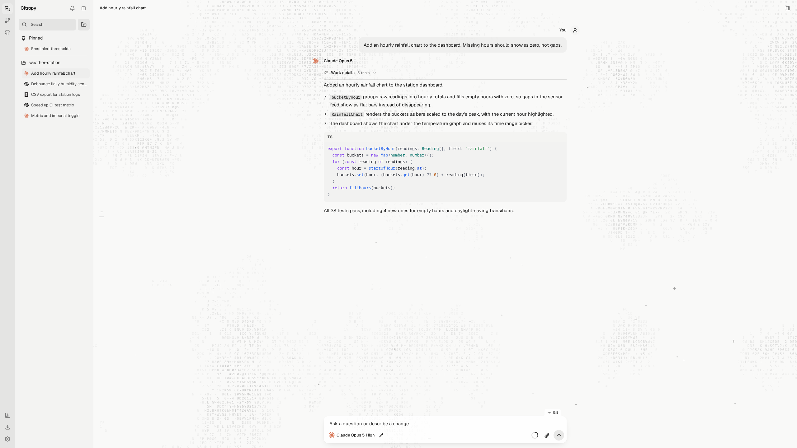
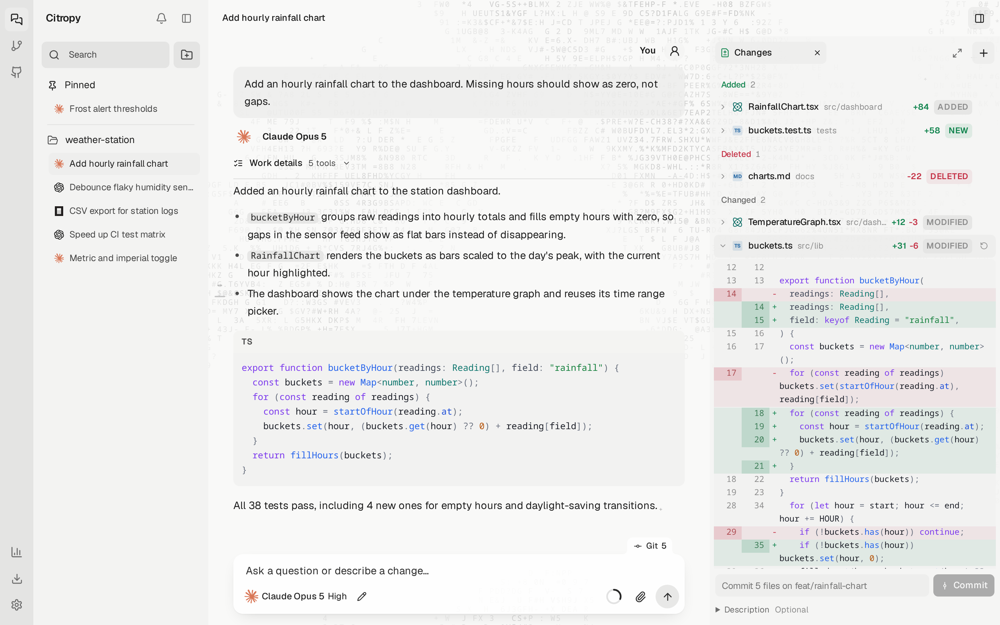
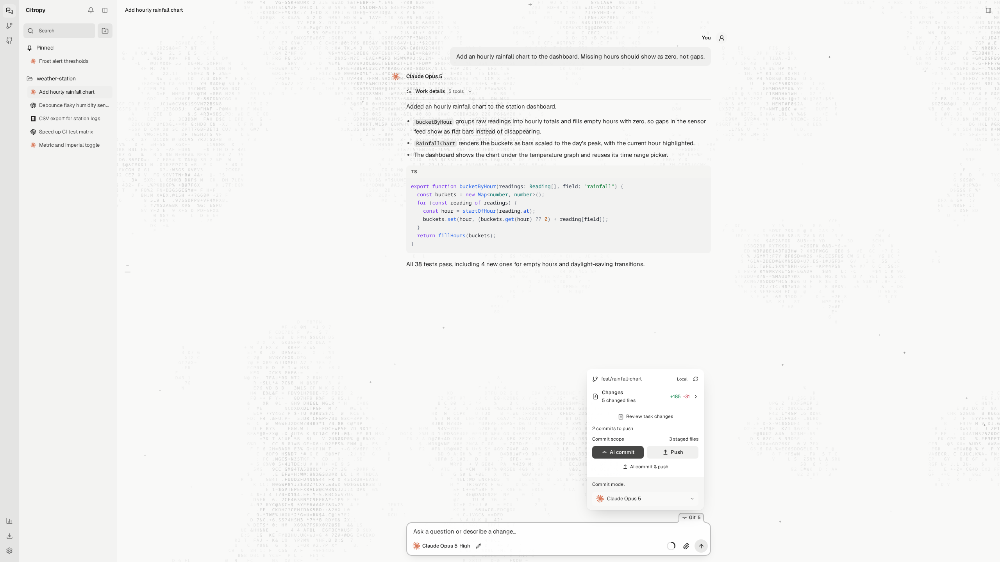
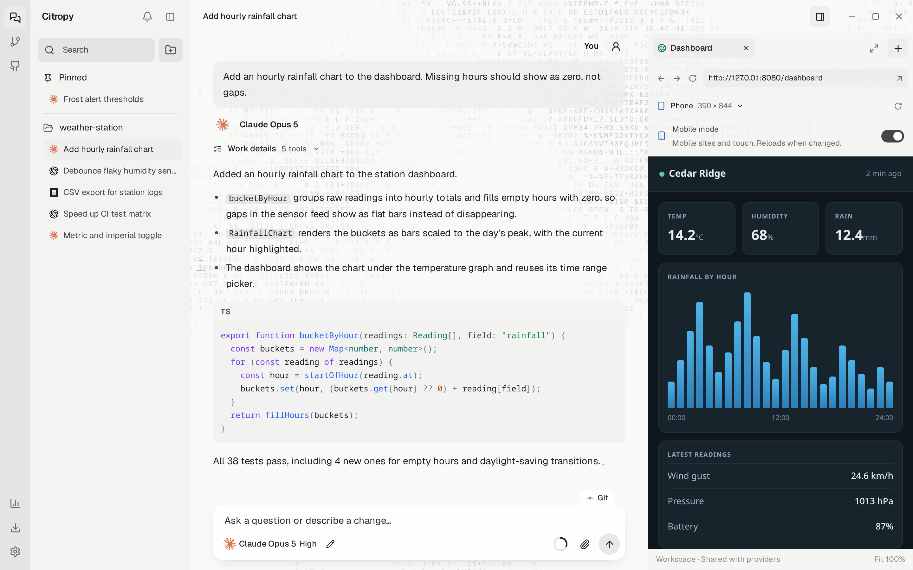
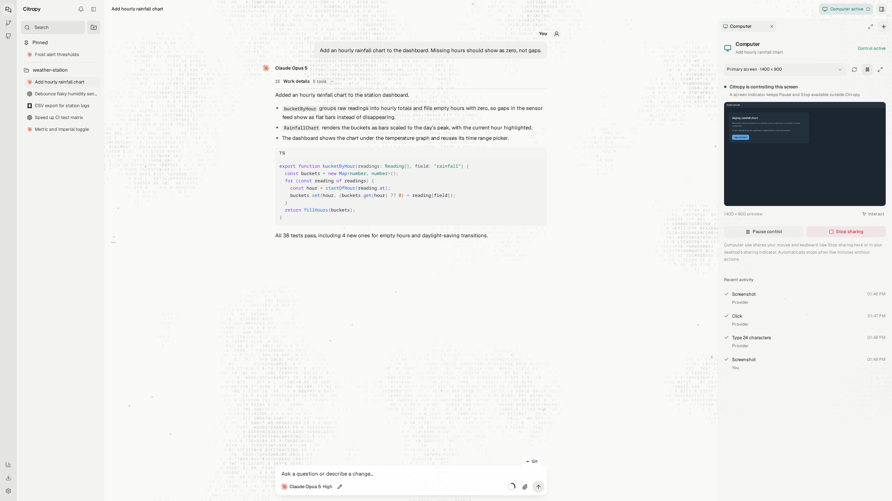
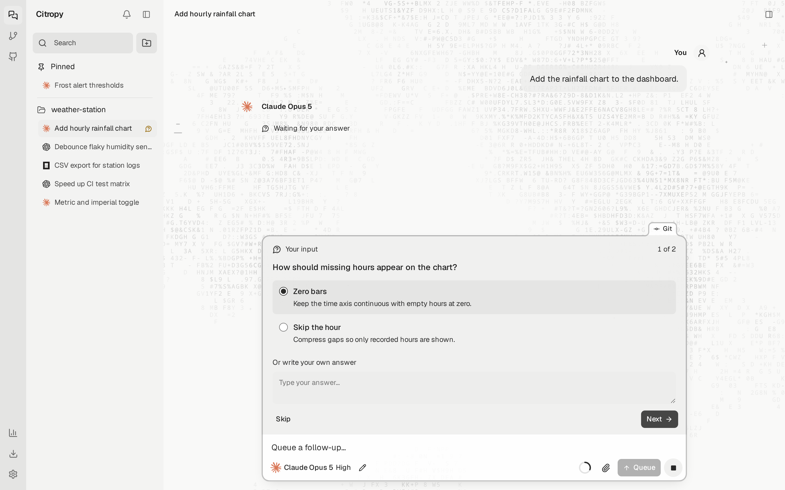
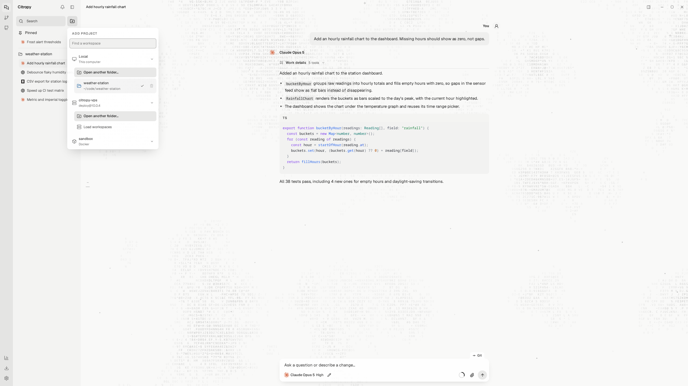
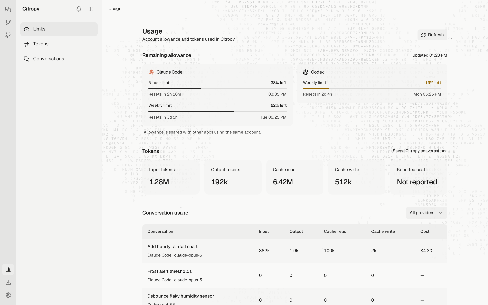

<div align="center">
  
  <h1>Citropy</h1>
  <p>One desktop app for Claude Code, Codex, OpenCode, Cursor, and Pi.</p>
  <p>
    <a href="https://github.com/tinuxongit/Citropy/releases/latest"></a>
    
    <a href="LICENSE"></a>
  </p>
</div>

## Install

**Linux and macOS**

```sh
curl -fsSL https://raw.githubusercontent.com/tinuxongit/Citropy/main/scripts/install.sh | sh
```

**Windows** (PowerShell)

```powershell
irm https://raw.githubusercontent.com/tinuxongit/Citropy/main/scripts/install.ps1 | iex
```

Run the same command again to update. Citropy also updates itself from Settings.

You need Git and at least one agent CLI installed and signed in: [Claude Code](https://docs.anthropic.com/en/docs/claude-code), [Codex](https://github.com/openai/codex), [OpenCode](https://opencode.ai), [Cursor CLI](https://cursor.com/cli), or [Pi](https://github.com/earendil-works/pi). Node.js is not required. The app ships its own runtime.

| System | Build | Installed to |
| --- | --- | --- |
| Linux | x86_64 AppImage | `~/.local/bin/citropy`, plus an application menu entry |
| macOS | Apple Silicon and Intel | `~/Applications/Citropy.app` |
| Windows | x64 | `%LOCALAPPDATA%\Programs\citropy`, plus a Start menu entry |

Nothing needs an administrator password. Manual downloads are on the [releases page](https://github.com/tinuxongit/Citropy/releases/latest).

<picture>
  <source media="(prefers-color-scheme: dark)" srcset="docs/assets/chat-dark.png">
  <source media="(prefers-color-scheme: light)" srcset="docs/assets/chat-light.png">
  
</picture>

## What it does

Citropy runs the coding agents you already use, side by side in one window. Each conversation keeps its own agent, model, reasoning effort, and permission mode. Files, Git, terminals, and browser tabs belong to the project, so every agent works on the same folder.

- **Every agent in one list.** Switch between Claude Code, Codex, OpenCode, Cursor, and Pi per conversation, or move a conversation to another agent and keep its history.
- **Review before you keep it.** Each turn is checkpointed. Read diffs, revert single hunks, comment on lines, and send the comments back to the agent.
- **Git and GitHub built in.** Stage, commit with an AI-written message, and push. Browse pull requests, issues, Actions runs, and releases without leaving the app.
- **Browser, terminal, and files beside the chat.** Agents can drive the same browser and terminals you see.
- **Computer use.** Let a conversation click and type in native apps on Linux and macOS.
- **Remote work.** Open folders on another machine over SSH, or in a Docker container.
- **Usage at a glance.** Claude Code and Codex limits with reset times, token totals, and live CPU and memory use.

## Review every change

<picture>
  <source media="(prefers-color-scheme: dark)" srcset="docs/assets/changes-dark.png">
  <source media="(prefers-color-scheme: light)" srcset="docs/assets/changes-light.png">
  
</picture>

Changed files are grouped into added, changed, and deleted, with the diff inline. Stage, unstage, or revert a single hunk. Any earlier message can be restored or branched into a new conversation.

## Commit and push

<picture>
  <source media="(prefers-color-scheme: dark)" srcset="docs/assets/git-dark.png">
  <source media="(prefers-color-scheme: light)" srcset="docs/assets/git-light.png">
  
</picture>

The Git panel shows the branch, change counts, and commits waiting to push. AI commit writes the message from the diff in a separate session, so it doesn't touch your conversation.

## Browser and terminals

<picture>
  <source media="(prefers-color-scheme: dark)" srcset="docs/assets/browser-dark.png">
  <source media="(prefers-color-scheme: light)" srcset="docs/assets/browser-light.png">
  
</picture>

The side panel holds a browser, terminals, a file tree, the changes view, subagents, and the list of tools agents can call. Tabs stay open while you switch between them. Agents use the same browser and terminals through Citropy's MCP tools, and phone-sized page presets are one click away.

## Code editor

Open **Files** from the workspace panel menu to browse and edit code. The editor uses [Microsoft Monaco](https://github.com/microsoft/monaco-editor), with new-file creation, file tabs, filename search, syntax highlighting, multiple cursors, folding, undo and redo, find and replace, and a command palette. Images, videos, and other previews open alongside code in the same tab strip. Expand the panel for more room, or keep it beside the conversation.

While Files is selected, terminal buttons, tabs, and the panel menu open shells beneath the editor without changing the view or leaving expanded mode. Hiding and reopening the dock reuses the selected shell. Drag the file explorer or terminal divider to resize it; sizes are remembered. Dividers also support arrow keys, Home/End, and double-click or Enter to reset.

Save with Ctrl+S or Cmd+S. F1 opens editor commands, including formatting for supported languages. JavaScript, TypeScript, JSON, HTML, and CSS language features run in workers. Language intelligence covers loaded files and Monaco's built-in libraries; this does not run the project's language servers, debugger, or VS Code extensions.

Edits use the selected conversation's worktree. Saves check the disk revision and replace the file using a temporary file, preserving its permission bits. Conflicts keep your draft open; copy any edits you want to retain before reloading the disk version. Open drafts and undo history survive panel and workspace switches within the current app session. Save before quitting; drafts are not persisted across restarts.

The editor loads separately from the initial app bundle. It supports UTF-8 text files up to 2 MB and keeps at most 24 files open. Binary files, non-UTF-8 files, and symbolic links cannot be edited.

## Computer use

<picture>
  <source media="(prefers-color-scheme: dark)" srcset="docs/assets/computer-dark.png">
  <source media="(prefers-color-scheme: light)" srcset="docs/assets/computer-light.png">
  
</picture>

Share a screen and a conversation can move the mouse, click, drag, scroll, and type in desktop apps. Input follows the conversation's permission mode. An on-screen indicator keeps pause and stop within reach, and the session ends after five idle minutes. Available on Linux and macOS.

## Questions in one place

<picture>
  <source media="(prefers-color-scheme: dark)" srcset="docs/assets/question-dark.png">
  <source media="(prefers-color-scheme: light)" srcset="docs/assets/question-light.png">
  
</picture>

When an agent needs a decision, it asks above the composer. Pick an option, choose several, write your own answer, or skip. Half-written answers survive switching conversations.

## SSH and Docker

<picture>
  <source media="(prefers-color-scheme: dark)" srcset="docs/assets/workspaces-dark.png">
  <source media="(prefers-color-scheme: light)" srcset="docs/assets/workspaces-light.png">
  
</picture>

Connect to a host over SSH or start a Docker container. Files, Git, terminals, and agents run on that machine while the window stays on yours. Citropy sets up Node.js on the remote host by itself if it's missing, on Linux and macOS hosts.

## Usage

<picture>
  <source media="(prefers-color-scheme: dark)" srcset="docs/assets/usage-dark.png">
  <source media="(prefers-color-scheme: light)" srcset="docs/assets/usage-light.png">
  
</picture>

See how much of your Claude Code and Codex allowance is left and when it resets, token totals for every conversation, and what's using memory and CPU right now.

## Uninstall

Your conversations and settings live in `~/.citropy` and are kept when you update or uninstall.

```sh
curl -fsSL https://raw.githubusercontent.com/tinuxongit/Citropy/main/scripts/install.sh | sh -s -- --uninstall
```

```powershell
$s = irm https://raw.githubusercontent.com/tinuxongit/Citropy/main/scripts/install.ps1; & ([scriptblock]::Create($s)) -Uninstall
```

## Build from source

Requires Node.js 22.18 or newer and Git.

```sh
git clone https://github.com/tinuxongit/Citropy.git
cd Citropy
npm install
npm run desktop
```

If the Electron download was skipped during `npm install`, run `npm run setup:desktop` once.

| Command | What it does |
| --- | --- |
| `npm run desktop:dev` | Desktop window with live reload. Uses separate data in `~/.citropy-dev` |
| `npm run dev` | Web development server, no desktop window |
| `npm start` | Web interface at http://127.0.0.1:4177 |
| `npm run typecheck` | TypeScript check |
| `npm test` | Test suite |
| `npm run desktop:package` | Build a release package into `release/` |
| `npm run screenshots` | Regenerate the images in `docs/assets` |

Packaging, smoke tests, and publishing are covered in [docs/release.md](docs/release.md).

## Documentation

The [guide](docs/guide.md) explains each part of the app in detail, plus storage and the code layout. Issues and pull requests are welcome.

## License

MIT. See [LICENSE](LICENSE). The bundled Inter and Geist Mono fonts are under the SIL Open Font License, with copies in `public/fonts`.
