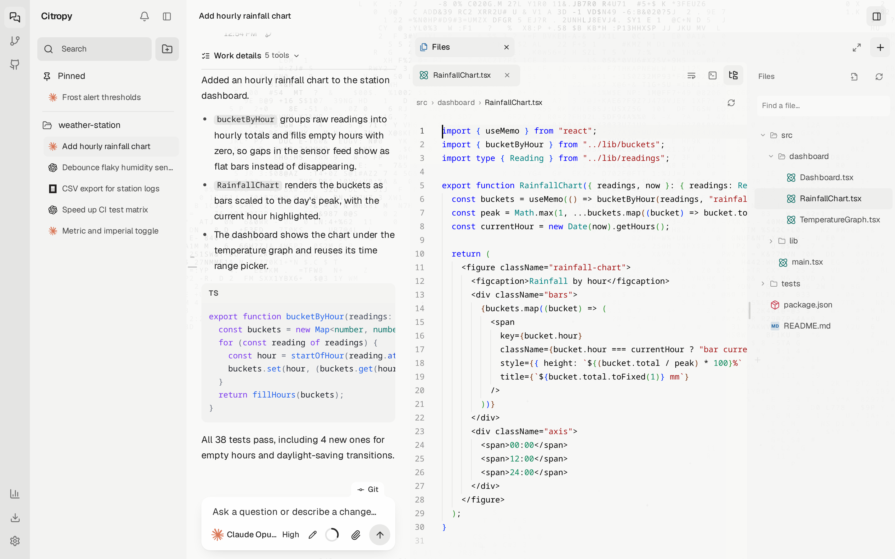

<div align="center">
  
  <h1>Citropy</h1>
  <p><b>Claude Code, Codex, OpenCode, Cursor, and Pi in one desktop app.</b></p>
  <p>
    <a href="https://github.com/tinuxongit/Citropy/releases/latest"></a>
    
    <a href="LICENSE"></a>
  </p>
  <p>
    <a href="#install">Install</a> ·
    <a href="#features">Features</a> ·
    <a href="docs/guide.md">Guide</a> ·
    <a href="https://github.com/tinuxongit/Citropy/releases/latest">Downloads</a>
  </p>
</div>

<picture>
  <source media="(prefers-color-scheme: dark)" srcset="docs/assets/chat-dark.png">
  <source media="(prefers-color-scheme: light)" srcset="docs/assets/chat-light.png">
  
</picture>

Run the coding agents you already use side by side. Each conversation picks its own agent, model, and permission mode, and can switch agents without losing its history. Files, Git, terminals, and the browser are shared by the whole project.

## Install

**Linux and macOS**

```sh
curl -fsSL https://raw.githubusercontent.com/tinuxongit/Citropy/main/scripts/install.sh | sh
```

**Windows** (PowerShell)

```powershell
irm https://raw.githubusercontent.com/tinuxongit/Citropy/main/scripts/install.ps1 | iex
```

You need Git and at least one signed-in agent CLI: [Claude Code](https://docs.anthropic.com/en/docs/claude-code), [Codex](https://github.com/openai/codex), [OpenCode](https://opencode.ai), [Cursor CLI](https://cursor.com/cli), or [Pi](https://github.com/earendil-works/pi). No Node.js or admin password needed. Citropy updates itself from Settings.

<details>
<summary>Where it installs</summary>

| System | Build | Installed to |
| --- | --- | --- |
| Linux | x86_64 AppImage | `~/.local/bin/citropy`, plus an application menu entry |
| macOS | Apple Silicon and Intel | `~/Applications/Citropy.app` |
| Windows | x64 | `%LOCALAPPDATA%\Programs\citropy`, plus a Start menu entry |

</details>

## Features

### Review every change

Changes are grouped into added, changed, and deleted. Stage, unstage, or revert a single hunk, and restore or branch from any earlier message.

<picture>
  <source media="(prefers-color-scheme: dark)" srcset="docs/assets/changes-dark.png">
  <source media="(prefers-color-scheme: light)" srcset="docs/assets/changes-light.png">
  
</picture>

### Commit and push

The Git tab above the composer shows the branch and what's waiting to push. AI commit writes the message in a separate session, so your conversation stays clean.

<picture>
  <source media="(prefers-color-scheme: dark)" srcset="docs/assets/git-dark.png">
  <source media="(prefers-color-scheme: light)" srcset="docs/assets/git-light.png">
  
</picture>

### Code editor

Browse and edit files with the Monaco editor, the one inside VS Code, right beside the conversation.

<picture>
  <source media="(prefers-color-scheme: dark)" srcset="docs/assets/editor-dark.png">
  <source media="(prefers-color-scheme: light)" srcset="docs/assets/editor-light.png">
  
</picture>

### Browser and terminals

Agents drive the same browser and terminals you see. The browser has phone and tablet sizes.

<picture>
  <source media="(prefers-color-scheme: dark)" srcset="docs/assets/browser-dark.png">
  <source media="(prefers-color-scheme: light)" srcset="docs/assets/browser-light.png">
  
</picture>

### Computer use

Share a screen and the agent can click and type in desktop apps. Pause or stop it anytime. Linux and macOS.

<picture>
  <source media="(prefers-color-scheme: dark)" srcset="docs/assets/computer-dark.png">
  <source media="(prefers-color-scheme: light)" srcset="docs/assets/computer-light.png">
  
</picture>

### Questions in one place

When an agent needs a decision, it asks above the composer. Pick one, pick several, or write your own.

<picture>
  <source media="(prefers-color-scheme: dark)" srcset="docs/assets/question-dark.png">
  <source media="(prefers-color-scheme: light)" srcset="docs/assets/question-light.png">
  
</picture>

### SSH and Docker

Open a folder on another machine or in a container from **Add project**. Agents, Git, and terminals run there. The window stays on yours.

<picture>
  <source media="(prefers-color-scheme: dark)" srcset="docs/assets/workspaces-dark.png">
  <source media="(prefers-color-scheme: light)" srcset="docs/assets/workspaces-light.png">
  
</picture>

### Usage

Claude Code and Codex allowance with reset times, plus token totals for every conversation.

<picture>
  <source media="(prefers-color-scheme: dark)" srcset="docs/assets/usage-dark.png">
  <source media="(prefers-color-scheme: light)" srcset="docs/assets/usage-light.png">
  
</picture>

## More

<details>
<summary>Uninstall</summary>

Conversations and settings live in `~/.citropy` and are kept.

```sh
curl -fsSL https://raw.githubusercontent.com/tinuxongit/Citropy/main/scripts/install.sh | sh -s -- --uninstall
```

```powershell
$s = irm https://raw.githubusercontent.com/tinuxongit/Citropy/main/scripts/install.ps1; & ([scriptblock]::Create($s)) -Uninstall
```

</details>

<details>
<summary>Build from source</summary>

Requires Node.js 22.18 or newer and Git.

```sh
git clone https://github.com/tinuxongit/Citropy.git
cd Citropy
npm install
npm run desktop
```

If the Electron download was skipped during `npm install`, run `npm run setup:desktop` once.

| Command | What it does |
| --- | --- |
| `npm run desktop:dev` | Desktop window with live reload. Uses separate data in `~/.citropy-dev` |
| `npm run dev` | Web development server, no desktop window |
| `npm start` | Web interface at http://127.0.0.1:4177 |
| `npm run typecheck` | TypeScript check |
| `npm test` | Test suite |
| `npm run desktop:package` | Build a release package into `release/` |
| `npm run screenshots` | Regenerate the images in `docs/assets` |

Packaging and publishing are in [docs/release.md](docs/release.md).

</details>

The [guide](docs/guide.md) covers every part of the app in detail. Issues and pull requests are welcome.

MIT licensed. See [LICENSE](LICENSE). The Geist font is bundled under the SIL Open Font License.
