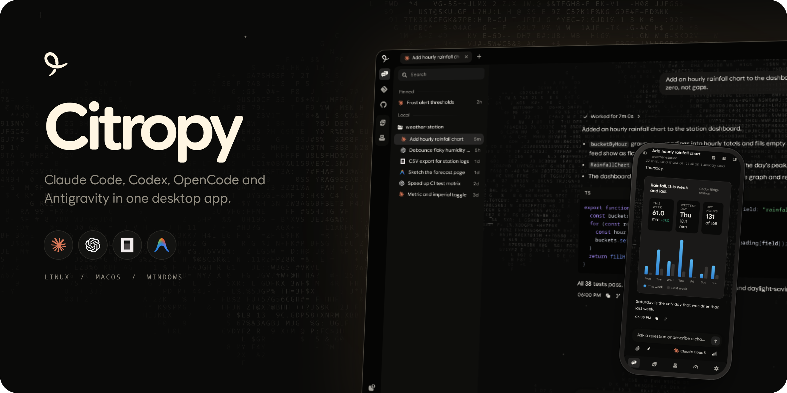
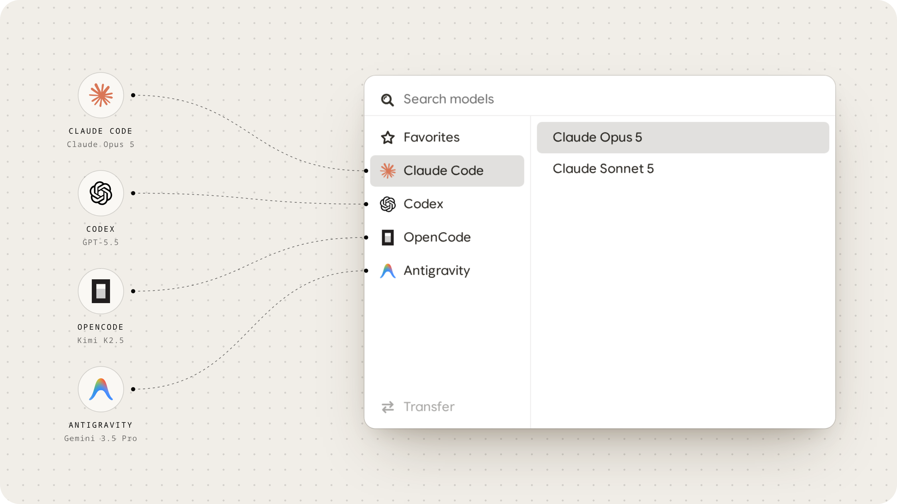
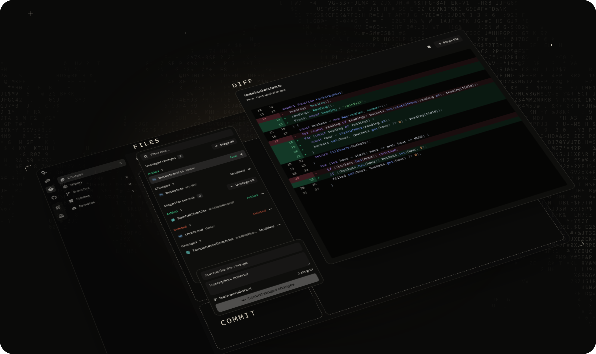
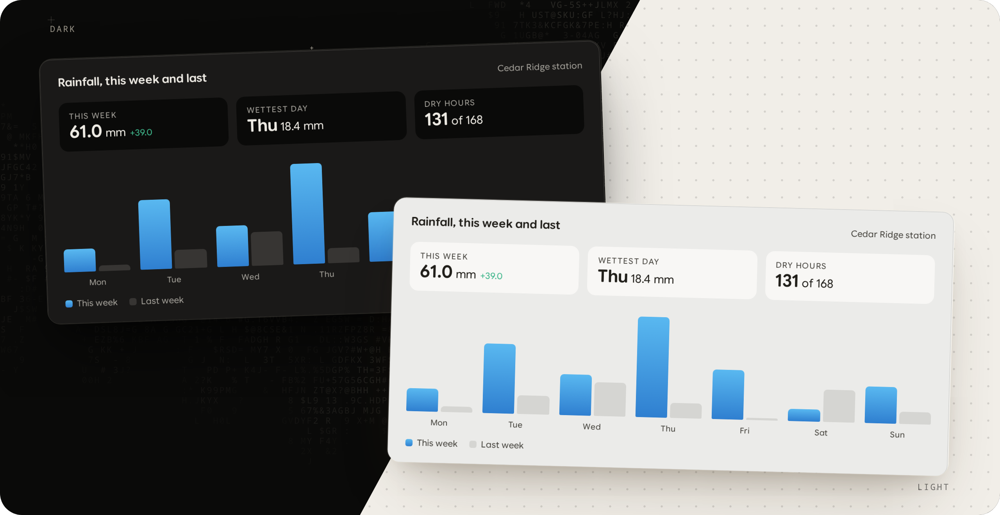
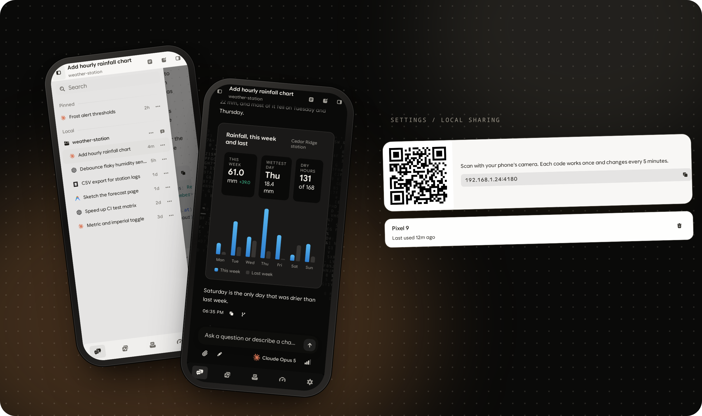
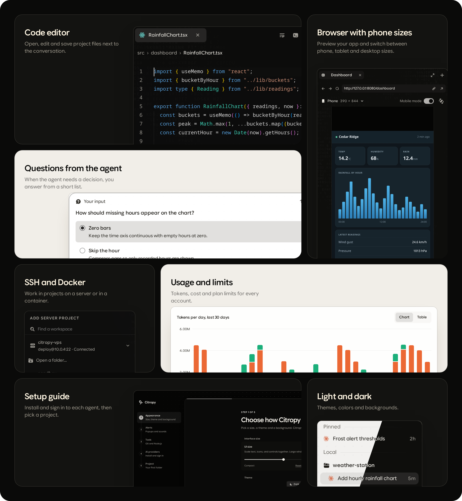

<div align="center">
  
  <p>
    <a href="https://github.com/tinuxongit/Citropy/releases/latest"></a>
    <a href="https://github.com/tinuxongit/Citropy/actions/workflows/checks.yml"></a>
    
    <a href="LICENSE"></a>
  </p>
  <p>
    <a href="#install"><b>Install</b></a> &nbsp;&middot;&nbsp;
    <a href="#one-window-four-agents">Features</a> &nbsp;&middot;&nbsp;
    <a href="docs/guide.md">Guide</a> &nbsp;&middot;&nbsp;
    <a href="CHANGELOG.md">Changelog</a> &nbsp;&middot;&nbsp;
    <a href="https://github.com/tinuxongit/Citropy/releases/latest">Downloads</a>
  </p>
</div>

<br>

Citropy runs the coding agents you already pay for in one desktop app. Each conversation picks its own agent, model and permission mode, and can switch agents halfway without losing its history. Files, Git, terminals and the browser belong to the project, so every agent works on the same things you see.

## Install

**Linux and macOS**

```sh
curl -fsSL https://raw.githubusercontent.com/tinuxongit/Citropy/main/scripts/install.sh | sh
```

**Windows** in PowerShell

```powershell
irm https://raw.githubusercontent.com/tinuxongit/Citropy/main/scripts/install.ps1 | iex
```

You need Git and one coding agent. On first launch the setup guide installs and signs in to [Claude Code](https://docs.anthropic.com/en/docs/claude-code), [Codex](https://github.com/openai/codex), [OpenCode](https://opencode.ai) or Google Antigravity. Antigravity downloads from Google. The other three install through npm, so they need Node.js. Citropy itself needs no Node.js or admin password, and updates itself from Settings.

<details>
<summary>Where it installs</summary>

| System | Build | Installed to |
| --- | --- | --- |
| Linux | x86_64 AppImage | `~/.local/bin/citropy`, plus an application menu entry |
| macOS | Apple Silicon and Intel | `~/Applications/Citropy.app` |
| Windows | x64 | `%LOCALAPPDATA%\Programs\citropy`, plus a Start menu entry |

</details>

<br>

## One window, four agents

Pick the agent and model for each conversation from one menu. Run Claude Code on one task and Codex on the next, or hand a conversation to another agent when the first runs out of usage. Extra accounts each get their own sign-in, and Settings > Providers sets which one new chats use.



## Review and commit

The Source control page groups changes into added, changed and deleted. Stage, unstage or revert a single hunk, read the diff beside the file list, and commit without leaving the app. AI commit writes the message in a separate session, so your conversation stays clean. You can also restore or branch from any earlier message.



## Answers you can use

Agents can reply with an interactive chart, table, calculator or mockup, drawn right inside the message. They build big pages in parts and can change one piece later without redrawing the rest. Turn visual replies off in Settings > Appearance.



## On your phone

Turn on Local sharing in Settings, scan the code with your phone's camera, and keep the same conversations going from the couch. Each code works once. Paired phones are listed in Settings, and you can remove one at any time.



## Everything else



The [guide](docs/guide.md) covers every part of the app in detail.

## More

<details>
<summary>Uninstall</summary>

Conversations and settings live in `~/.citropy` and are kept.

```sh
curl -fsSL https://raw.githubusercontent.com/tinuxongit/Citropy/main/scripts/install.sh | sh -s -- --uninstall
```

```powershell
$s = irm https://raw.githubusercontent.com/tinuxongit/Citropy/main/scripts/install.ps1; & ([scriptblock]::Create($s)) -Uninstall
```

</details>

<details>
<summary>Build from source</summary>

Requires Node.js 22.18 or newer and Git.

```sh
git clone https://github.com/tinuxongit/Citropy.git
cd Citropy
npm install
npm run desktop
```

If the Electron download was skipped during `npm install`, run `npm run setup:desktop` once.

| Command | What it does |
| --- | --- |
| `npm run desktop:dev` | Desktop window with live reload. Uses separate data in `~/.citropy-dev` |
| `npm run dev` | Web development server, no desktop window |
| `npm start` | Web interface at http://127.0.0.1:4177 |
| `npm run typecheck` | TypeScript check |
| `npm test` | Test suite |
| `npm run desktop:package` | Build a release package into `release/` |
| `npm run screenshots` | Capture the app with sample data and rebuild the README images in `docs/assets` from `tests/readme-art`. Pass scene names, such as `chat git`, to capture only those and skip the images |

Packaging and publishing are in [docs/release.md](docs/release.md).

</details>

Issues and pull requests are welcome.

MIT licensed. See [LICENSE](LICENSE). The Citropy Sans font, a modified Google Sans Flex, is bundled under the SIL Open Font License.
